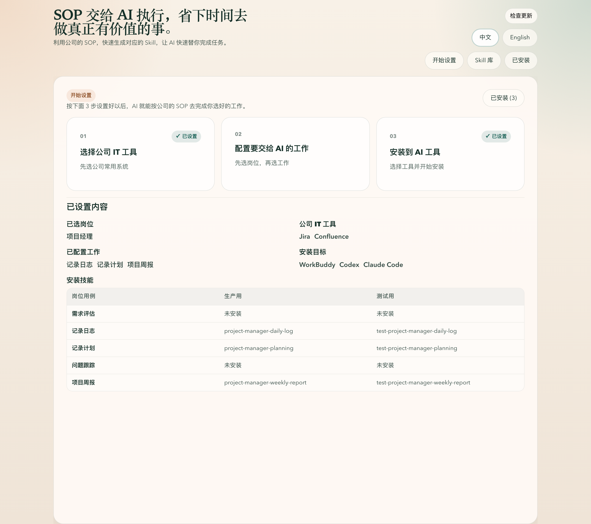

# skills-for-no-engineer

[English](./README.md)

把现有 SOP 用傻瓜化配置方式，直接变成 AI 可运行的 skill，让非工程人员也能完成配置。

## 项目特点

- 把公司内部的 SOP、模板、链接和示例整理成可运行的 AI skill。
- 通过引导式配置代替手工写 prompt 或改配置文件。
- 让岗位默认用例、默认说明和公司 IT 工具绑定都通过配置文件管理。
- 应用界面支持中英文双语。

## 截图



## 安装方式

### 本地桌面应用

需要本机已有可用的 Rust stable toolchain 和 Tauri 构建环境。

本地环境要求和各平台构建步骤请看[本地构建指南](./LOCAL_BUILD_CN.md)。

```bash
npm ci
npm run tauri:dev
```

如果要在当前平台生成本地桌面安装包：

```bash
npm run tauri:build
```
