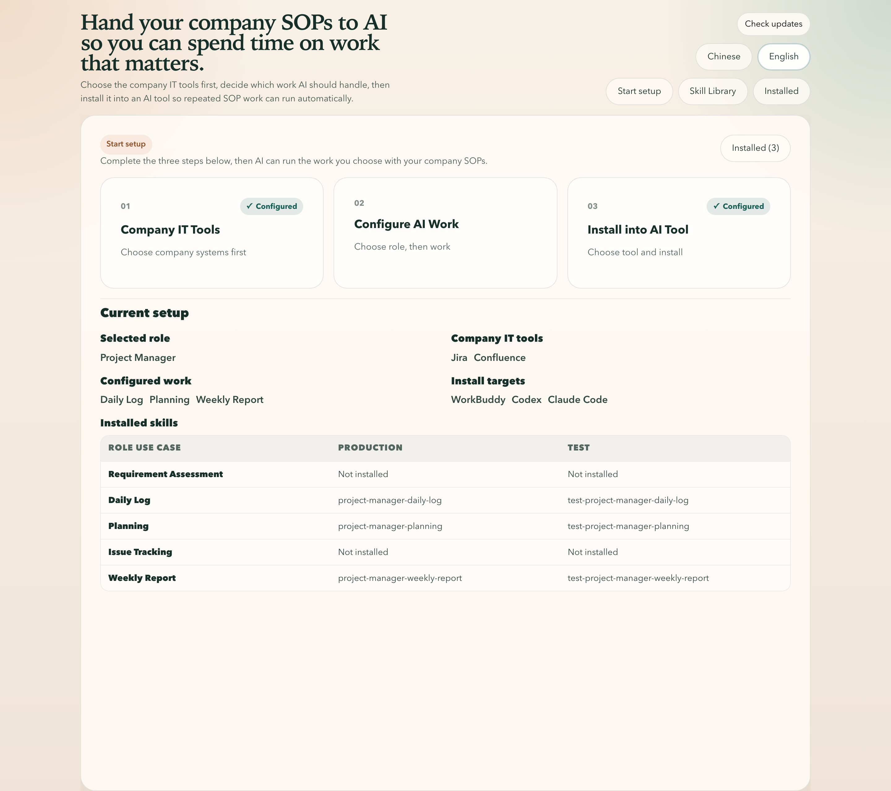

# SOP to Skill 🚀
> Turn company SOPs, templates, and system setup into installable AI skills

<div align="center">
  

  <h3>An AI Skill configuration desk for non-engineering teams</h3>
  <p>Use guided setup to connect role-based work, company IT tools, and SOP rules, then sync the result into Codex, Claude Code, or WorkBuddy.</p>

  <p>
    
    
    
    
    
  </p>

  <p>
    <a href="#-project-overview">Project Overview</a> •
    <a href="#-core-capabilities">Core Capabilities</a> •
    <a href="#-ui-tour">UI Tour</a> •
    <a href="#-technical-architecture">Technical Architecture</a> •
    <a href="#-quick-start">Quick Start</a> •
    <a href="#-project-structure">Project Structure</a>
  </p>

  <p>
    <a href="./README.md">简体中文</a> |
    <strong>English</strong>
  </p>
</div>

---

## 📌 Project Overview

`SOP to Skill` is a desktop application for turning the SOPs, templates, links, credentials, and role workflows that already exist inside a company into AI-runnable skills.

The goal is not to make operations teams hand-write prompts or maintain raw config files. Instead, the app guides users through a setup flow that connects:

- company IT tools such as `Jira`, `Confluence`, `Gerrit`, `SVN`, `Linux`, and `Tencent Exmail`
- role-based work use cases for `Project Manager`, `QA Manager`, and `IT Manager`
- SOP rules, information sources, and execution constraints
- production and test skill packages for `Codex`, `Claude Code`, and `WorkBuddy`

If the problem is "how do we turn the way our company already works into something AI can actually execute?", this repository is the implementation of that answer.

## 🆕 v0.2.0 Highlights

- Added `QA Manager` and `IT Manager` onboarding roles, each with five built-in daily work use cases.
- Expanded built-in base skills to `Jira`, `Confluence`, `Gerrit`, `SVN`, `Linux`, and `Tencent Exmail`.
- Added automatic environment checks after users select base skills, plus manual connection tests once credentials are filled in.
- Added multi-device Linux onboarding input, multi-repository SVN onboarding input, and guided environment installation support.
- Added desktop log export, visible build-version display, and persisted storage version migration for safer upgrades.

## ✨ Core Capabilities

### 1. Guided onboarding

- Replaces manual prompt writing and low-level config editing with a three-step onboarding flow
- Lets users configure company IT tools first, then role work, then installation targets
- Reduces setup friction for non-engineering users

### 2. Role and use-case driven setup

- Select work scope by role before editing any detailed instructions
- Default visible roles now include `Project Manager`, `QA Manager`, and `IT Manager`
- Maintain description, information sources, and execution rules per use case
- Add custom use cases alongside built-in ones

### 3. Company infrastructure binding

- Built-in infrastructure currently includes `Jira`, `Confluence`, `Gerrit`, `SVN`, `Linux`, and `Tencent Exmail`
- Credentials are saved during onboarding and synced early so later steps can use them directly
- Deselecting a tool removes its managed configuration as well
- Filled credentials can run manual connection tests, Linux supports multiple device records, and SVN supports multiple repository records

### 4. Dual package generation and install preview

- Generates both production and test skills for each role/use-case pair
- Shows install previews before syncing changes
- Supports syncing the same managed skill set into multiple AI apps

### 5. Environment checks, logs, and upgrade readiness

- Base skills can trigger runtime environment detection and supported auto-install guidance
- Connection-test and environment-install progress are shown directly in onboarding, and Windows background commands no longer flash extra `cmd` windows
- The top bar can export application logs for bug reports
- The top bar also shows the current build version so local and release builds are easy to identify
- Release builds include updater wiring and persisted storage migration support

### 6. Bilingual desktop experience

- The app supports both Chinese and English
- The repository README is also available in both languages
- Suitable for internal pilots, demos, and operational rollout

## 🖼 UI Tour



The main setup flow is split into three modules:

- `Choose Company IT Tools`
- `Configure Work For AI`
- `Install To AI Tools`

That keeps the setup aligned with the way business users actually think about the problem instead of exposing technical internals first.

## 🏗 Technical Architecture

- Frontend: `React` + `TypeScript` + `Vite`
- Desktop shell: `Tauri v2`
- Backend command layer: `Rust`
- Skill content: templates, scripts, and docs under `skills/`
- Onboarding persistence and install sync: frontend state + Tauri commands + local filesystem

The high-level flow is:

1. collect role, use case, infrastructure, and install-target settings in the desktop UI
2. use Rust commands to persist state, build previews, stage generated packages, and sync installations
3. render repository-backed skill templates into installable skill directories

## 🚀 Quick Start

### Run the desktop app locally

You need a working Rust stable toolchain and a local Tauri build environment.

```bash
npm ci
npm run tauri:dev
```

### Common commands

```bash
npm test
npm run build
npm run tauri:build
```

### Local build guides

Platform-specific prerequisites and build details are documented here:

- [Local Build Guide (English)](./LOCAL_BUILD.md)
- [本地构建指南（中文）](./LOCAL_BUILD_CN.md)

## 🗂 Project Structure

```text
.
├── docs/                     Docs and README screenshots
├── skills/                   Built-in skill templates and scripts
├── scripts/                  Build, install, and verification scripts
├── src/                      React frontend and onboarding UI
├── src-tauri/                Tauri / Rust backend commands and desktop config
├── LOCAL_BUILD.md            English local build guide
├── LOCAL_BUILD_CN.md         Chinese local build guide
├── README.md                 Chinese primary README
└── README_EN.md              English README
```

## 📚 Related Docs

- [中文 README](./README.md)
- [Changelog](./CHANGELOG.md)
- [Local Build Guide (English)](./LOCAL_BUILD.md)
- [本地构建指南（中文）](./LOCAL_BUILD_CN.md)
- [Docs landing content](./docs/index.md)

## 📄 License

This project is released under the [MIT License](./LICENSE).
