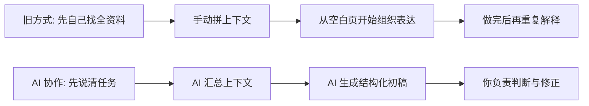

AI Workstyle Invitation

<h1>AI 时代先受益的，是每天被重复工作困住的人。</h1>

如果你是传统公司里的普通员工，AI 最先带来的不是遥远的组织战略，而是更少的重复劳动、更轻的沟通压力、和更快把事情做成的能力。

这不是一页写给高管的 AI 口号，也不是一张产品参数表。它只回答一件事：AI 会怎样先让普通人的工作轻一点、快一点、清楚一点。

<nav class="hero-nav" aria-label="页面导航">
<a href="#pain-points">你的烦恼</a>
<a href="#workstyle-shift">工作方式变化</a>
<a href="#day-contrast">一天对比</a>
<a href="#benefits">你会得到什么</a>
<a href="#roles">谁都能用</a>
<a href="#proof-points">先从哪里开始</a>
<a href="#closing">最后一句话</a>
</nav>

## 这些麻烦，你大概每天都在碰

传统公司的低效，不一定来自你不努力，更多时候是因为大量时间被消耗在重复表达、信息搬运和跨人沟通上。

<strong>会前 10 分钟疯狂找资料</strong>
临时翻聊天记录、找旧文档、补项目上下文，真正讨论开始前人已经先累了。

<strong>同一件事写三遍</strong>
给同事一版，给领导一版，给客户一版，内容差不多，表达却要反复重写。

<strong>时间花在追人，不花在做事</strong>
很多工作并不难，难的是把分散在不同人手里的信息拼起来。

<strong>明明做了很多，周报还是难写</strong>
不是你没有产出，而是整理、抽象、表达本身又成了一份额外工作。

<strong>事情一多，脑子先被切碎</strong>
刚处理完一个群消息，就去改文档；刚整理完文档，又被拉进另一个会议。

<strong>越忙越难体现价值</strong>
重复劳动会吞掉你的注意力，让你难以把精力用在真正有判断力的部分。

## AI 帮你的，不只是写几句话

真正的变化不是多一个聊天窗口，而是你可以先把任务说清楚，再让 AI 帮你整理信息、组织表达、补全上下文、生成第一稿。

<ul class="bullet-stack">
<li>先说出任务，而不是先自己把所有材料凑齐。</li>
<li>先拿到一个结构化草稿，再花精力修正和判断。</li>
<li>让 AI 接管重复整理，你把时间留给沟通和决策。</li>
</ul>

## 没有 AI 的一天，和有 AI 协作的一天

抽象地说“效率提升”很难让人代入。把一天拆开看，你就能更直观地看到差别。

<article class="timeline-card low">

<h3>没有 AI 的一天</h3>

信息散、表达慢、上下文全靠人脑拼。

<ul class="timeline-list">
<li><strong>09:10</strong> 刚到工位先补上下文，翻昨天群聊、找会议纪要、看表格最新版本，半小时过去还没进入真正工作。</li>
<li><strong>11:20</strong> 回应别人前先切四个窗口，问你进度的人很多，但答案散在不同地方，每次回复都像临时拼图。</li>
<li><strong>15:00</strong> 开始写材料时从空白页发呆，项目更新、客户说明、方案摘要都知道大概要写什么，但很难快速落成。</li>
<li><strong>18:40</strong> 下班前还在补一份能发出去的总结，真正让人疲惫的不是工作本身，而是做完以后还要再解释一遍。</li>
</ul>
</article>

<article class="timeline-card high">

<h3>有 AI 协作的一天</h3>

先把任务说出来，再把重复和整理交给 AI。

<ul class="timeline-list">
<li><strong>09:10</strong> 先让 AI 汇总上下文，把任务目标说清楚，先拿到关键背景、待办重点和缺失信息，再开始行动。</li>
<li><strong>11:20</strong> 先出结构化回复，再补你的判断，进度说明、风险同步、会议回答先有框架，你只需要校正最关键的部分。</li>
<li><strong>15:00</strong> 从第一稿开始，而不是从空白开始，AI 先把素材整理成提纲、摘要或草稿，你把精力留给修正、取舍和定调。</li>
<li><strong>18:40</strong> 让收尾工作不再拖垮你，日报、周报、纪要、待办汇总先自动成形，下班前更多是在确认，而不是硬撑。</li>
</ul>
</article>

## 这对你自己的好处，比公司宣传里写得更具体

如果你只是把 AI 理解成“帮公司提效”，那很难真正开始。真正能推动一个人行动的，往往是那些他每天马上就能感受到的变化。

01
<strong>节省时间</strong>
把搜索、整理、改写、汇总这些重复动作压缩掉，让真正需要判断的部分占据你的工作日。

02
<strong>降低精神消耗</strong>
很多疲惫感来自频繁切换和无休止复述。AI 先接住这些碎片劳动，人会轻很多。

03
<strong>提升表达质量</strong>
不是每个人天生擅长结构化表达，但大多数岗位都需要它。AI 能先把表达门槛拉低。

04
<strong>增加职业价值</strong>
未来更稀缺的不是最会埋头重复的人，而是能更快整合信息、组织行动、推动结果的人。

## 这不是程序员专属，而是绝大多数岗位都能开始用

只要你的工作包含搜索信息、整理材料、沟通协作、汇报总结、标准化输出，AI 就能先帮你减掉一部分重复劳动。

<strong>销售</strong>
整理客户背景、组织跟进话术、生成会后总结，减少大量机械重复。

<strong>运营</strong>
从分散信息里提炼重点，把日报、活动复盘、跨团队同步做得更快。

<strong>HR</strong>
整理岗位说明、培训材料、面试反馈和制度答疑，让沟通更标准。

<strong>项目经理</strong>
快速汇总进度、风险、待办和会议结论，让项目状态更容易讲清楚。

<strong>交付 / 实施</strong>
查找历史方案、整理客户问题、生成交付说明，减少反复找资料。

<strong>财务</strong>
汇总报销说明、审批材料、预算说明，让规则解释和文本整理更省力。

<strong>行政</strong>
把通知、会议安排、制度整理、跨部门确认变成更轻的例行工作。

<strong>客服 / 支持</strong>
快速整合问题背景、标准答案和跟进记录，让回复既快又稳。

## 你不需要先变成专家，先从最烦的环节开始就够了

公开页面最重要的不是许诺一个遥远的新世界，而是让人看到自己下周就可以开始改变什么。

<ul class="bullet-stack">
<li>先从写作最痛的地方开始，让 AI 帮你先起草邮件、总结、会议纪要和汇报提纲，不再每次都从零开始。</li>
<li>再从找资料最慢的地方开始，把你常用的文档、说明、问题记录喂给 AI，让它先帮你聚合，再由你判断。</li>
<li>最后把协作最耗神的地方交出去，对于状态同步、进度说明、答疑回复这类高频动作，先让 AI 生成第一版。</li>
</ul>

## 未来拉开差距的，往往不是最忙的人

<blockquote class="closing-quote">
AI 时代真正先拉开差距的，往往不是最忙的人，而是最先学会与 AI 协作的人。
</blockquote>

你不需要一下子把全部工作都交给 AI，也不需要先变成技术专家。你只需要比昨天更早一步，把那些最消耗你、最重复、最容易被标准化的部分，交给 AI 做你的搭档。

<ul class="bullet-stack">
<li>你会更快进入真正重要的工作，而不是一直卡在准备阶段。</li>
<li>你会更容易把做过的事说清楚，而不是总在收尾时焦虑。</li>
<li>你会逐渐把价值放回判断、沟通和推动结果，而不是反复搬运信息。</li>
</ul>
