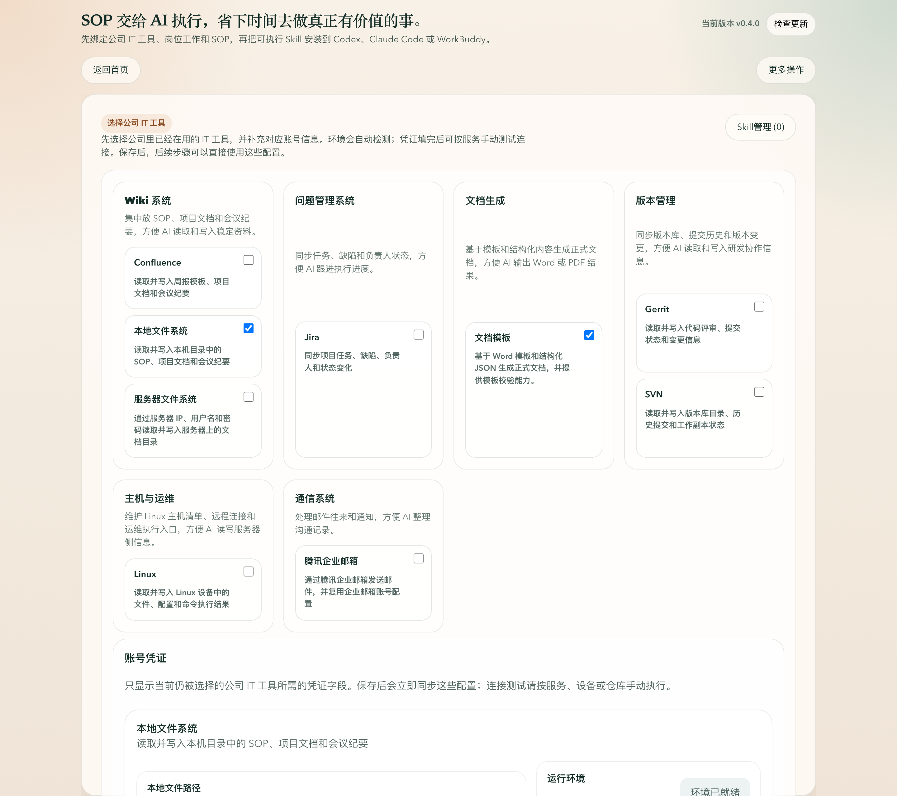
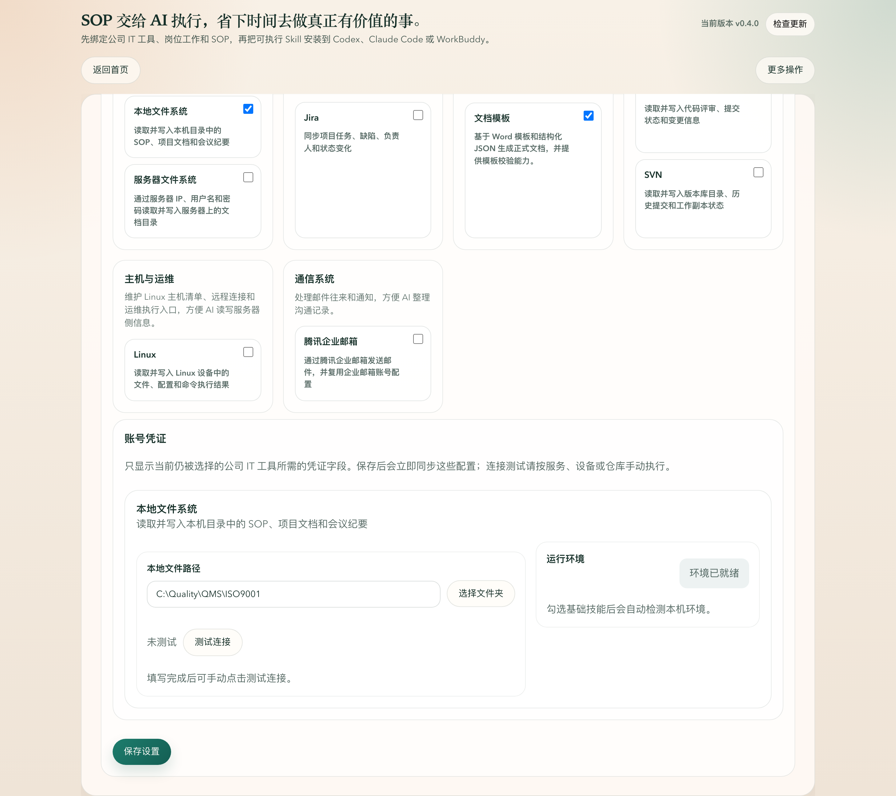

# 用文件夹选择构建质量 Skill

质量类 Skill 通常需要读取一组本地资料，例如质量体系文件、内审检查表、8D 报告模板、客户投诉记录和历史整改材料。新的文件夹选择功能让用户通过图形界面选择资料目录，不需要手动输入路径，能减少路径拼写错误和权限范围不清的问题。

## 适用场景

这条流程适合质量经理或质量工程师把本地质量资料接入 AI 工具，例如：

- ISO9001 内审检查准备
- 8D 报告整理
- 质量问题复盘
- 供应商质量审核
- 客诉或批次异常分析

建议把同一类质量资料整理到一个根目录中，例如：

```text
C:\Quality\QMS\ISO9001
├── SOP
├── Templates
├── AuditRecords
├── 8DReports
└── CustomerComplaints
```

## 1. 选择基础工具

打开 SOP-to-Skill 后，进入 **选择公司 IT 工具**。在基础工具里勾选：

- **本地文件系统**：让生成的 Skill 能读取和写入本机质量资料目录。
- **文档模板**：当质量输出需要 Word 模板、检查表或报告格式时使用。

勾选后，下方会出现 **本地文件路径** 字段。这里不需要手动输入路径，点击 **选择文件夹**。



## 2. 通过图形界面选择质量资料目录

在系统文件夹选择窗口中选择质量资料根目录。确认后，路径会自动填入 **本地文件路径**。



填入后点击 **保存设置**。如果需要确认目录是否可访问，可以点击 **测试连接**。

## 3. 配置质量经理用例

回到首页，进入 **配置要交给 AI 的工作**。

1. 选择岗位：**质量经理**。
2. 选择要构建的质量用例，例如 **ISO9001 内审检查** 或 **8D 报告准备**。
3. 在信息来源中说明刚才选择的本地目录包含哪些资料。
4. 在执行规则中写清输出要求，例如先核对条款、再列发现项、最后给出整改责任人和期限。

示例填写：

```text
信息来源：
本地质量体系文件夹：C:\Quality\QMS\ISO9001
内审检查表模板：C:\Quality\QMS\ISO9001\Templates\internal-audit.xlsx
历史问题记录：C:\Quality\QMS\ISO9001\AuditRecords

执行规则：
先按 ISO9001 条款核对证据，再输出发现项、风险等级、整改责任人和完成期限。
如果资料不足，先列出缺失证据，不要直接编造结论。
```

## 4. 生成并安装质量 Skill

进入 **安装到 AI 工具**：

1. 选择要安装到的目标工具，例如 Codex、Claude Code 或 WorkBuddy。
2. 勾选生成的质量 Skill 和测试 Skill。
3. 查看安装预览，确认会新增的 Skill。
4. 点击 **开始同步安装**。

安装完成后，目标 AI 工具会获得一个可调用的质量 Skill。后续使用时，只需要说明本次任务，例如：

```text
请使用 ISO9001 内审检查 Skill，基于本地质量体系目录，准备一次研发流程内审检查清单。
重点检查设计评审、需求变更和问题闭环记录。
```

## 使用建议

- 选择资料根目录时，尽量选覆盖完整质量上下文的上层目录，不要只选单个模板文件所在目录。
- 如果不同质量任务资料差异很大，可以分别建立多个质量用例，每个用例写清自己的目录范围和规则。
- 本地文件系统适合本机资料；如果资料在服务器上，优先配置服务器文件系统或其他公司 IT 工具。
- 文档模板只负责模板化输出，真实依据仍应来自本地资料目录、Jira、Confluence 或其他已配置系统。

## 常见问题

### 可以继续手动输入路径吗？

文件夹路径字段现在以图形界面选择为主。这样能减少路径错误，并确保用户选择的是目录而不是文件。

### 选择目录后会不会复制文件？

不会。这里保存的是目录路径，Skill 使用时会基于这个路径读取资料。原始文件仍保留在用户本机。

### 质量资料更新后需要重新生成 Skill 吗？

通常不需要。只要目录路径不变，资料内容更新后，AI 工具下次读取的就是新资料。只有规则、用例描述或目录结构发生明显变化时，才建议回到 SOP-to-Skill 更新配置并重新同步。
